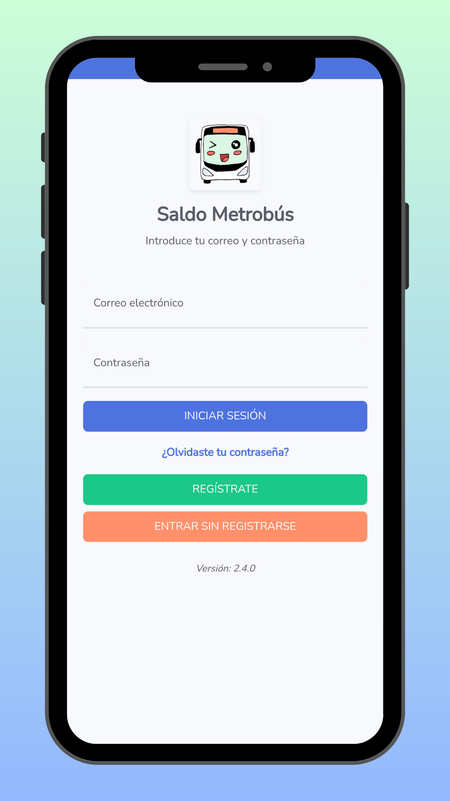

# Saldo Metrobús APP

Saldo Metrobús es una aplicación móvil que permite a los usuarios de Panamá consultar el saldo y movimientos de todas sus tarjetas de metro y metrobús.

Puedes almacenar todas tus tarjetas en la aplicación, asignándoles nombres personalizados para identificarlas fácilmente. Si lo deseas, puedes crear una cuenta opcional durante el registro con tu correo electrónico y contraseña. Al vincular tus tarjetas a tu correo electrónico, puedes acceder a todas tus tarjetas de forma automática en caso de cambiar de dispositivo.

Con solo presionar un botón, puedes actualizar el saldo y los movimientos de tus tarjetas en cualquier momento del día. Sin embargo, ten en cuenta que la actualización puede tardar hasta 15 o 30 minutos en reflejarse desde el último movimiento o acción realizada con tu tarjeta debido al retraso de actualización impuesto por las fuentes oficiales.

La pestaña de gráficas de la aplicación te permite visualizar tus gastos, cambios de saldo y cargas en un formato gráfico fácil de entender. La aplicación cuenta con una interfaz amigable y sencilla de utilizar, disponible en dos idiomas (Español e Inglés), con una opción de modo oscuro para mejorar la visión nocturna.

Descargo de responsabilidad: Todos los datos de las tarjetas son obtenidos de la fuente oficial del servicio en el sitio a de consultas http://www.tarjetametrobus.com/ el cual ofrece esta información en todo Panamá. Esta aplicación no es oficial y no pertenece ni está respaldada por una afiliación gubernamental.

# Descargar

# Demo

